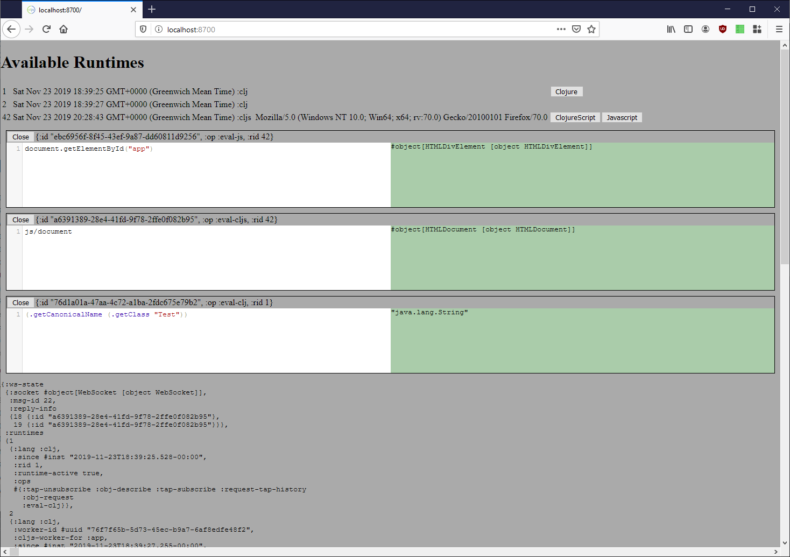

# Tham'ra

>  Agree politely, but delete nothing. Never apologize for who you are. 

Some spare parts that might one day become tools.

Start shadow-cljs, then view at [localhost:8700](http://localhost:8700)

```bash
$ clj -A:deps:dev:repl
...
shadow-cljs - HTTP server available at http://localhost:8700
shadow-cljs - server version: 2.8.74 running at http://localhost:9630
...
user=> (start)
[:app] Configuring build.
[:app] Compiling ...
[:app] Build completed. (187 files, 2 compiled, 0 warnings, 2.42s)
:watching
```

## Latest progress

`shadow-remote` REPLs into client and server. Application state in `citrus` , views controlled by React hooks. No visual component.



